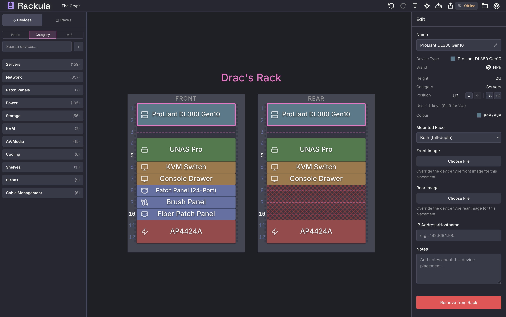

<p align="center">
  <a href="https://count.racku.la">
    <picture>
      <source media="(prefers-color-scheme: dark)" srcset="assets/Rackula-lockup-dark.svg">
      <source media="(prefers-color-scheme: light)" srcset="assets/Rackula-lockup-light.svg">
      
    </picture>
  </a>
</p>

<p align="center">
  <strong>Drag-and-drop rack layout designer</strong><br>
  Plan your rack, move some pixels, save your shoulders.
</p>

<p align="center">
  <a href="LICENSE"></a>
  
  <a href="https://github.com/RackulaLives/Rackula/pkgs/container/Rackula"></a>
  
  <a href="https://github.com/RackulaLives/Rackula/actions/workflows/test.yml"></a>
</p>

<p align="center">
  
</p>

<p align="center">
  
</p>

---

## Features

- Drag and drop devices into your rack from a real hardware library
- Real device images from the NetBox devicetype-library, not grey boxes
- Export layouts to PNG, PDF, or SVG for documentation and change requests
- Share layouts via URL or QR code, no file attachments needed
- Mobile-friendly interface for field use
- Bayed rack grouping for AV installs and multi-cabinet deployments
- Optional persistent storage with API-backed layout sync
- Self-hostable via Docker, Proxmox LXC, or bare metal
- Optional auth with local accounts or OIDC for shared deployments

## Who It's For

| Audience                 | Use Case                                                                                                    |
| ------------------------ | ----------------------------------------------------------------------------------------------------------- |
| **Homelabbers**          | Plan your server rack before you rack it. Move pixels, not 4U servers.                                      |
| **AV Technicians**       | Bayed rack support for audio installs, map out amp racks, patch bays, and processor chains.                 |
| **Network Engineers**    | Document and plan switch/router topologies. Export for runbooks and change requests.                        |
| **Data Centre Teams**    | Layout planning for colo cages and enterprise cabinets. Share via URL with your team.                       |
| **Educators & Students** | Teach networking and infrastructure concepts with a visual, hands-on tool. No licence keys, no gatekeeping. |

## Why Though?

You might ask, why should I make an imaginary rack like some sort of IT cosplay? And to that I would say, "fine then! don't! SCRAM!" but also, consider:

- **Plan your layouts** before you build them. It's a lot easier to move your mouse than that 4U server full of hard drives. Your shoulder will thank you.
- **Document existing layouts** so you know what is where.
- **Because you can**

## Get Started

### Use it right now

**[count.racku.la](https://count.racku.la)** no account, no install, just racks.

### Self-host with Docker

```bash
docker run -d -p 8080:8080 ghcr.io/rackulalives/rackula:latest
```

Or with Docker Compose:

```bash
curl -O https://raw.githubusercontent.com/RackulaLives/Rackula/main/docker-compose.yml
docker compose up -d
```

Open `http://localhost:8080` and get after it.

### Deploy on Proxmox (LXC)

Rackula is available as a Proxmox VE community-scripts LXC container:

1. In the Proxmox web UI, go to your node → **CT Templates**
2. Select the **Rackula** script from the community-scripts catalog
3. Deploy with defaults (1 CPU, 512 MB RAM, 8 GB disk)

The API write token (for persistent storage) is auto-generated during install. Find it at `/opt/rackula/data/.env`. You only need it if you're using the persistence API.

> **Note:** LXC is currently in pre-release. See the [Self-Hosting Guide](docs/guides/SELF-HOSTING.md) for details and manual install instructions.

### Persistent Storage

For layouts that persist across browser sessions:

```bash
curl -fsSL https://raw.githubusercontent.com/RackulaLives/Rackula/main/deploy/docker-compose.persist.yml -o docker-compose.yml
mkdir -p data && sudo chown 1001:1001 data
docker compose up -d
```

### Build from Source

```bash
git clone https://github.com/RackulaLives/Rackula.git
cd Rackula && npm install && npm run build
```

Serve the `dist/` folder however you like. It's just files.

### Security & Auth

For production deployments, configure API security and authentication:

```bash
# Generate secrets
openssl rand -hex 32  # API write token
openssl rand -hex 32  # Session secret (if using auth)
```

Set `CORS_ORIGIN`, `RACKULA_API_WRITE_TOKEN`, and optionally `RACKULA_AUTH_MODE` (`none`, `local`, or `oidc`) in your `.env` file.

See the [Self-Hosting Guide](docs/guides/SELF-HOSTING.md) for full configuration details including auth modes, env vars, and TLS setup.

## Built With Claude

This project was built using AI-assisted development with Claude. I told it what to build and then said "no, not like that" a lot. The AI did a lot of typing. Commits with substantial AI contributions are marked with `Co-authored-by` tags because we're not going to pretend otherwise.

## Documentation

- [Architecture Overview](docs/ARCHITECTURE.md)
- [Technical Spec](docs/reference/SPEC.md)
- [Self-Hosting Guide](docs/guides/SELF-HOSTING.md)
- [Changelog](CHANGELOG.md)
- [Contributing Guide](CONTRIBUTING.md)
- [Discussions](https://github.com/RackulaLives/Rackula/discussions)

## Acknowledgements

Built for the [r/homelab](https://reddit.com/r/homelab) and [r/selfhosted](https://reddit.com/r/selfhosted) communities. Colours from [Dracula Theme](https://draculatheme.com/). Device data from [NetBox devicetype-library](https://github.com/netbox-community/devicetype-library). See [ACKNOWLEDGEMENTS.md](ACKNOWLEDGEMENTS.md) for full credits.

## Star History

<a href="https://star-history.com/#RackulaLives/Rackula&Date">
  <picture>
    <source media="(prefers-color-scheme: dark)" srcset="https://api.star-history.com/svg?repos=RackulaLives/Rackula&type=Date&theme=dark" />
    <source media="(prefers-color-scheme: light)" srcset="https://api.star-history.com/svg?repos=RackulaLives/Rackula&type=Date" />
    
  </picture>
</a>

## Licence

[MIT](LICENSE) Copyright &copy; 2025-2026 Gareth Evans
